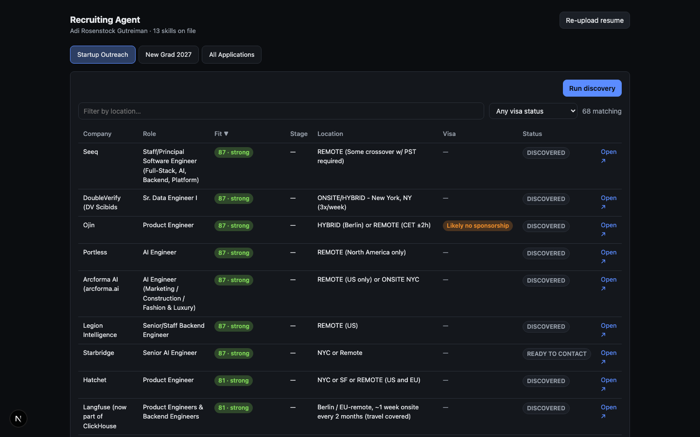
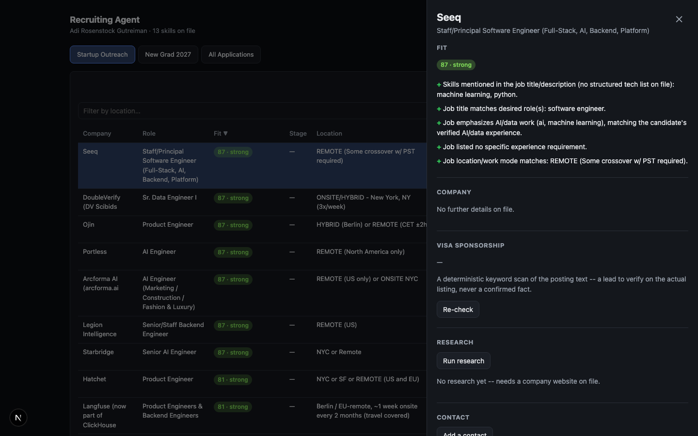
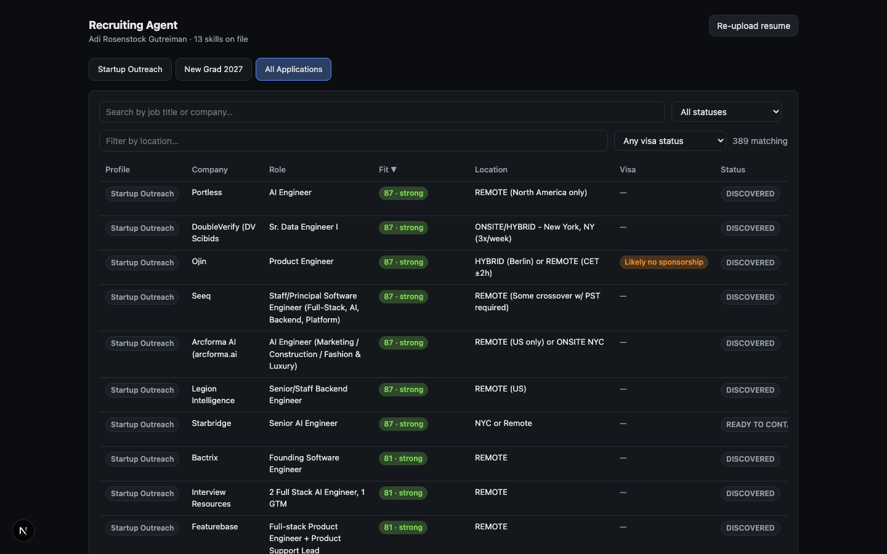

# Recruiting Agent

[](https://github.com/AdiRosenstock/Recruiting_Agent/actions/workflows/ci.yml)


A full-stack, agentic **startup** job-search system, designed and built solo: resume in,
structured evidence-backed candidate profile out; live discovery against real early-stage
startup sources; a deterministic, explainable fit score for every job; company research with
facts kept verifiably separate from inferences; and a drafted, human-approved outreach message
-- never sent automatically. Scoped to startups specifically, not a general job tracker -- see
[Pipeline](#pipeline). The throughline across every piece: an LLM is used exactly where judgment
is genuinely needed and nowhere else, and nothing it produces is ever presented as more certain
than it actually is.

**Jump to:** [Highlights](#highlights) · [Screenshots](#screenshots) ·
[Architecture](#pipeline) · [Run it yourself](#local-setup) ·
[Architecture notes](#architecture-notes) · [About](#about-the-author)

## Highlights

- **Full stack, solo:** FastAPI + SQLAlchemy 2.0 + PostgreSQL backend, Next.js 16 / React 19 /
  TypeScript dashboard, Docker Compose deployment (with real healthchecks, not just `Up`),
  GitHub Actions CI. 191 backend tests, 96% coverage, zero live-network calls in the suite --
  and a full Playwright end-to-end run against the real app on every meaningful change, not just
  unit tests in isolation.
- **Real external data, not fixtures.** Live discovery adapters against Hacker News' "Who is
  Hiring" API and YC's public company directory -- both startup-specific sources, no login, no
  API key, no scraping of anything that says no: checked a candidate source's `robots.txt`
  before writing an adapter for it, and didn't build one when it disallowed the exact pages
  needed (see the [Roadmap](#roadmap)) rather than building it anyway.
- **An architecture built around not hallucinating.** Every LLM call returns a validated Pydantic
  model, never free text to parse hopefully. Every "fact" the company-research agent extracts is
  re-verified verbatim against the actual fetched page text before being trusted -- a claim that
  can't be verified is *demoted* to an inference, never silently dropped, never left posing as
  more certain than it is. One evidence-verification function backs both resume skill-claims and
  company research, so the check stays consistent as it evolves.
- **Deterministic, explainable scoring, computed automatically.** A 7-component weighted fit
  score with human-readable strengths/gaps -- no LLM ever asked to "just output a number," and
  no manual "Score" click needed either: scoring is wired directly into discovery, so a score is
  already there the moment a job is found. Found and fixed a real bug in the scorer itself by
  actually looking at live data, not just trusting the code: 227 of 389 real scored jobs shared
  one identical score. Root-caused it to a scoring source with no structured data to
  differentiate on, fixed the fallback, and re-verified the fix moved real numbers (17 jobs
  newly hit "strong" tier, up from zero).
- **A visa-sponsorship detector**, same philosophy: a negation-aware deterministic keyword
  scanner, not an LLM guess. Caught and fixed a false-positive in my own test cases before ever
  shipping it ("not eligible for sponsorship" was matching the positive pattern). Run for real
  against 389 live job postings; every hit spot-checked by hand -- zero false positives.
- **Nothing here sends anything to anyone, by design, not as an afterthought.** Outreach is
  drafted, reviewed, and manually sent by a human. No LinkedIn automation, no scraping of people,
  no auto-contacting -- enforced structurally (there is no code path from a draft to a send),
  not just by convention.

## Screenshots



*68 real jobs, discovered live from Hacker News and YC's public directory for a seed-stage NYC
startup search -- sortable by fit, location, or visa-sponsorship signal.*



*Every score is explainable -- strengths and gaps in plain English, never a black-box number.*



*A cross-profile view across every job-search agent at once, with its own search/filter/sort.*

## Pipeline


Startup-only, by design: the **`startup_outreach`** search profile -- seed-Series B NYC
startups, small teams, outreach enabled -- is the only one seeded, and every discovery source
(HN's "Who is Hiring" thread, YC's public directory) is itself startup-focused. An earlier
`new_grad_2027` profile cast a "wide net across company sizes" (i.e. including large, non-startup
employers) and has been removed entirely -- see the [Roadmap](#roadmap).

`search_profiles` stays a real table, not a single hardcoded config, so a second *startup*-focused
profile (a different stage or location cut, say) is still just a config row away, not a new code
path -- see `scripts/seed_profiles.py`.

## What's here

**Phase 1 -- candidate profile:**
- Resume upload (PDF) -> deterministic text extraction -> LLM-structured extraction ->
  deterministic evidence verification against the resume's own text -> normalized, persisted
  candidate profile.
- Every skill claim carries evidence snippets cross-checked against the resume; unverifiable
  claims are kept (not silently dropped) but flagged `verified: false` with downgraded
  confidence, so nothing invented by the LLM is presented as confirmed fact.
- An `LLMProvider` abstraction: real OpenAI/Anthropic implementations plus a deterministic,
  no-network `stub` so the whole pipeline runs without any API key.

**Phase 2 -- search profiles, discovery, fit scoring:**
- `search_profiles`: one row per agent (see above), holding its own `config` (role/stage/
  location filters, fit-score weight overrides) and `outreach_enabled` flag.
- Discovery adapters (`services/discovery/`), real and network-verified against live data, all
  needing no login/API key and entirely deterministic (regex/HTML/JSON parsing, no LLM call),
  both feeding `startup_outreach`: `HNWhoIsHiringSource` (HN's public "who is hiring" thread) and
  `YCDirectorySource` (YC's public company directory dataset). Two discovery *patterns* exist --
  `JobBoardSource` (posting-first: HN) and `CompanySource` (company-first: YC) -- a profile can
  run both kinds at once (see `api/routers/discovery.py`); a startup-focused source that's
  posting-first (a second `JobBoardSource`) slots in the same way HN did, no new pattern needed.
  `YCDirectorySource` is deliberately company-only: YC's public dataset has no per-company job
  postings (only an `isHiring` flag), so `get_jobs()` always returns `[]` rather than fabricating
  a job URL. Company/job dedup goes through `CompanyJobUpsertService`.
- A deterministic, explainable `FitScorer` (`services/scoring/`) -- seven independently
  unit-testable components (technical/role/AI-data/experience/stage/location/domain match),
  weighted-summed into a 0-100 score with a tier and human-readable strengths/gaps. No LLM call.
  Never hard-rejects for a job asking slightly more experience than the candidate has; a missing
  personal connection is neutral, never scored as a weakness. `technical_match` falls back to a
  word-boundary scan of the job title/description for the candidate's own skill names when a
  source has no structured `technologies` list -- found via live data (against a since-removed
  source that was especially sparse on structured fields) that a flat neutral score for every
  such job, regardless of what it actually was, was producing a wall of identical overall scores
  across hundreds of postings. `services/scoring/service.py`'s `score_if_unscored` is
  wired directly into the discovery runner, so every newly discovered job is scored the moment
  it's found -- no separate step, no per-job "Score" click required to see a result. Never
  re-scores an application that already has one (a manual re-score isn't silently clobbered by
  the next discovery run); `POST /jobs/{id}/score` still exists for an explicit re-score.
- A `SearchProvider` abstraction (`services/search/`) with a real, no-API-key implementation --
  `DuckDuckGoSearchProvider` uses DuckDuckGo's plain HTML results page (the same no-JS endpoint
  it serves browsers with JavaScript disabled). Company Research primarily works directly off a
  company's own `website` when one's on file; when it isn't, this is the fallback (see Phase 3
  below) rather than giving up immediately.

**Phase 3 -- research, contacts, outreach, human-approval workflow:**
- **Company Research Agent** (`services/research/`): deterministically fetches a company's
  website (no search API needed -- just the URL already on file; if there isn't one,
  `website_lookup.py` falls back to `SearchProvider` for "`<company> official website"`,
  filters out aggregators/social sites, and uses the first plausible result -- unverified,
  flagged as such in the run's warnings until the fetched page passes the same evidence check
  everything else does), has an LLM split what it finds into FACTS (each verified verbatim
  against the fetched page, same evidence-check approach as resume parsing) and INFERENCES. A
  claimed fact that can't be verified is *demoted* to an inference, never dropped and never left
  posing as more certain than it is. A hit against the shared personal-connection triggers
  (`app/domain_connections.py` -- the same list the fit scorer uses) is stored as its own
  inference row. Re-running research on an unchanged page doesn't pile up duplicate rows.
- **Contacts** (`services/contacts.py`): manual entry -- no LinkedIn scraping, no login
  automation, ever -- with a deterministic priority rank computed from the spec's two priority
  lists
  (very-early-stage vs. larger company, by employee count).
- **Outreach Message Agent** (`services/outreach/`): drafts `linkedin_full` /
  `linkedin_connection` / `email` variants from real assembled context (candidate background,
  job, company research, contact), in the "smart college senior" voice from the spec, with a
  deterministic banned-phrase filter (`services/outreach/banned_phrases.py`) flagging
  corporate-sounding phrases the spec explicitly rules out. Nothing is ever sent automatically.
- **Human-approval workflow**: `applications.status` moves through
  `DISCOVERED -> ... -> REVIEW -> READY_TO_CONTACT -> CONTACTED -> RESPONDED -> ...` entirely
  via explicit `PATCH /applications/{id}` calls -- an agent only ever *proposes* a transition
  (e.g. outreach generation bumps a fresh application to `REVIEW`), never sends or finalizes one.
- **Visa sponsorship signal** (`services/visa_sponsorship.py` + `services/visa_check.py`):
  deterministic keyword scan (same philosophy as `domain_connections.py` -- a fixed phrase list,
  never an LLM guess) for whether a posting mentions sponsorship either way. Scans the listing
  text already on file first; only fetches the live posting page when there's nothing there to
  search (a job discovered with no description at all). `POST
  /api/v1/jobs/{id}/check-visa-sponsorship` for one job at a time (the dashboard's button);
  `scripts/check_visa_sponsorship.py` to run it across every job under a profile. Always a lead
  to verify on the real posting -- stored with the literal matched phrase as evidence, never
  presented as a confirmed fact.

**Dashboard (`frontend/`):** a Next.js 16 + TypeScript + React client dashboard -- onboarding
(create candidate, upload resume), one-click default profile setup, profile tabs with a
discovery button and a sortable/filterable (location, visa sponsorship) jobs table, a
cross-profile "All Applications" tab (search, status/location/visa filters, sortable columns),
and a job detail panel covering everything above: fit breakdown, visa sponsorship (check it),
research (run it, FACTS vs. INFERENCES), contacts (add, auto-ranked), outreach (generate, edit
inline, copy), and the status workflow. See `frontend/README.md`.

## Prerequisites

- Python 3.12+ (3.11+ also works)
- Docker + Docker Compose, for Postgres. If you don't already have Docker Desktop, the
  lightweight option on macOS is [colima](https://github.com/abiquo/colima):
  ```
  brew install colima docker docker-compose
  colima start
  ```

## Local setup

```bash
# 1. Clone / open this repo, then from the repo root:
cp .env.example .env

# 2. Start Postgres (runs on port 5433, not 5432, to avoid clashing with any Postgres you
#    already run locally -- see "Why port 5433?" below)
docker compose up -d db

# 3. Backend setup
cd backend
python3.12 -m venv .venv
.venv/bin/pip install -e ".[dev]"

# 4. Run migrations
.venv/bin/alembic upgrade head

# 5. Run the API
.venv/bin/uvicorn app.main:app --reload
```

The API is now at `http://localhost:8000` (interactive docs at `/docs`).

### Dashboard

```bash
cd frontend
npm install
npm run dev
```

Now at `http://localhost:3000` -- open it and follow the onboarding flow (create a candidate,
optionally upload a resume, create the default search profile, run discovery). See
`frontend/README.md` for details, including the Playwright end-to-end smoke test. Everything
below this point also works entirely via `curl`/`/docs` if you'd rather skip the UI.

Once both `.venv` and `node_modules` exist, `./scripts/dev.sh` starts Postgres + backend
(`--reload`) + frontend together in one terminal (Ctrl+C stops backend/frontend; `db` is left
running, same as the manual steps above) -- steps 2/5 and the dashboard's `npm run dev`, combined.

### Getting from a resume to scored, discovered jobs

```bash
# 1. Create a candidate and upload a resume (Phase 1)
CAND_ID=$(curl -s -X POST http://localhost:8000/api/v1/candidates \
  -H "Content-Type: application/json" -d '{"full_name": "Your Name"}' | python3 -c "import sys,json;print(json.load(sys.stdin)['id'])")

curl -s -X POST http://localhost:8000/api/v1/candidates/$CAND_ID/resume \
  -F "file=@/path/to/resume.pdf;type=application/pdf"

# 2. Seed the default search profile for that candidate (idempotent, safe to re-run)
.venv/bin/python scripts/seed_profiles.py --candidate-id $CAND_ID

# 3. List the profiles to get their ids
curl -s "http://localhost:8000/api/v1/search-profiles?candidate_id=$CAND_ID"

# 4. Run discovery for a profile (hits the real HN/GitHub sources) -- every newly discovered
#    job is scored automatically as part of the same run, no separate step and no manual
#    "Score" click needed; the response says how many
curl -s -X POST http://localhost:8000/api/v1/discovery/run \
  -H "Content-Type: application/json" -d '{"profile_id": "<profile-id>"}'

# 5. See every job tracked under a profile, highest score first -- each entry carries the
#    application_id every later action (research/outreach/status) is keyed off
curl -s "http://localhost:8000/api/v1/search-profiles/<profile-id>/jobs"

# 6. Optional: re-score one job by hand (e.g. after editing that profile's weights, or a
#    manually-added job that predates a resume upload)
curl -s -X POST http://localhost:8000/api/v1/jobs/<job-id>/score \
  -H "Content-Type: application/json" \
  -d "{\"candidate_id\": \"$CAND_ID\", \"profile_id\": \"<profile-id>\"}"
```

Companies/jobs can also be added manually: `POST /api/v1/companies`, then `POST
/api/v1/companies/{id}/jobs` -- these aren't scored automatically (there's no discovery run to
hang the scoring off of), so step 6 is how to score them.

Discovery scores everything it finds automatically, so there's usually nothing to batch-score.
`scripts/batch_score.py` covers the cases that aren't automatic: manually-added jobs, jobs
discovered before a resume was on file (discovery skips scoring, not the whole run, when there's
no candidate profile yet -- see its response's `warnings`), or re-scoring everything after a
scoring-logic change:

```bash
.venv/bin/python scripts/batch_score.py --candidate-id $CAND_ID
.venv/bin/python scripts/batch_score.py --profile-id <profile-id> --rescore   # after a scoring-logic change
```

### From a scored job to a drafted, human-reviewed outreach message

```bash
# 1. Research the company (works from its `website` if one's on file; otherwise falls back to
#    a web search for one first -- see SEARCH_PROVIDER above)
curl -s -X POST http://localhost:8000/api/v1/companies/<company-id>/research/run
curl -s http://localhost:8000/api/v1/companies/<company-id>/research

# 2. Add a contact -- priority rank/rationale are computed automatically
curl -s -X POST http://localhost:8000/api/v1/companies/<company-id>/contacts \
  -H "Content-Type: application/json" \
  -d '{"name": "Jane Doe", "title": "Co-Founder & CEO", "public_profile_url": "https://linkedin.com/in/janedoe"}'

# 3. Link the contact to the application (from step 6 above)
curl -s -X PATCH http://localhost:8000/api/v1/applications/<application-id> \
  -H "Content-Type: application/json" -d '{"contact_id": "<contact-id>"}'

# 4. Generate outreach (only works if the profile has outreach_enabled=true) -- this
#    auto-advances a fresh application to REVIEW status, it does NOT send anything
curl -s -X POST http://localhost:8000/api/v1/applications/<application-id>/outreach

# 5. Edit a drafted message by hand if you want to change the wording
curl -s -X PATCH http://localhost:8000/api/v1/outreach-messages/<message-id> \
  -H "Content-Type: application/json" -d '{"content": "..."}'

# 6. Approve / mark contacted once you've sent it yourself, manually, outside this app
curl -s -X PATCH http://localhost:8000/api/v1/applications/<application-id> \
  -H "Content-Type: application/json" -d '{"status": "CONTACTED"}'
```

### LLM provider configuration

By default `.env` sets `LLM_PROVIDER=stub` -- a deterministic, keyword/regex-based extractor
that needs no API key. It reliably finds contact info and a small fixed list of skill keywords,
but does **not** reconstruct education/experience/project entries (this is called out explicitly
in its output's `gaps` field). It exists so the pipeline is runnable and testable without a key,
not as a substitute for real extraction quality.

For real extraction, set in `.env`:

```
LLM_PROVIDER=openai        # or: anthropic
OPENAI_API_KEY=sk-...
# or
ANTHROPIC_API_KEY=sk-ant-...
```

`SEARCH_PROVIDER` defaults to `duckduckgo` -- no API key needed (see `services/search/
duckduckgo_provider.py`). The Company Research Agent only calls it as a fallback, when a
company has no `website` on file. Set `SEARCH_PROVIDER=stub` for fully offline work, or if
you'd rather Company Research just skip companies with no website on file instead of guessing
one.

### Why port 5433?

This machine had a native (Homebrew) Postgres already running on the default 5432 -- something
this project didn't set up. Rather than touch or stop a service we don't own, `docker-compose.yml`
maps the project's Postgres to `5433` on the host instead. Change `POSTGRES_PORT` in `.env` (and
the matching `DATABASE_URL*` host:port) if 5433 is also taken on your machine.

## Tests, lint, types

```bash
cd backend
docker compose -f ../docker-compose.yml up -d db   # if not already running
.venv/bin/pytest                 # unit tests need nothing external; integration tests need Postgres
.venv/bin/ruff check .
.venv/bin/ruff format --check .
.venv/bin/mypy app
```

`.github/workflows/ci.yml` runs exactly these (plus `frontend`'s `typecheck`/`lint`/`build`) on
every push/PR against a real Postgres service container -- `LLM_PROVIDER=stub`/
`SEARCH_PROVIDER=stub`, no API keys or live network calls needed. `e2e/smoke.mjs` stays a
manual pre-release check (needs a live backend and hits real external sources), not part of CI.

Unit tests for the discovery adapters mock HTTP (fixture shapes were confirmed against the real
HN Algolia API and the real GitHub tracker README during development, but tests never hit the
network) -- integration tests use a monkeypatched adapter registry for the same reason. Nothing
in the test suite makes a live network call.

The test suite creates/migrates a separate `recruiting_agent_test` database automatically (see
`tests/conftest.py`); it does not touch the dev database. If it doesn't exist yet:

```bash
docker compose exec db psql -U recruiting_agent -d recruiting_agent -c "CREATE DATABASE recruiting_agent_test;"
```

### Evaluation harness

`scripts/evaluate.py` is a different kind of check than `pytest`: not exact-equality assertions,
but a repeatable report on (1) `FitScorer` run end-to-end over a small golden set of realistic
(candidate, job, company, profile) cases -- each chosen to exercise one documented scoring
decision (extra experience doesn't cliff to zero, a personal-connection hit moves the score, a
profile that zeroes its stage weight actually gets zero stage penalty) -- PASS/FAIL against an
expected tier range; and (2) the LLM-driven agents' actual output (company research, outreach drafts)
printed for a human to read and judge, since there's no boolean to assert a real model's prose
against. Standalone -- no database, no HTTP server:

```bash
.venv/bin/python scripts/evaluate.py            # LLM_PROVIDER=stub (deterministic, from .env)
LLM_PROVIDER=openai .venv/bin/python scripts/evaluate.py   # meaningful quality read, needs a key
```

Useful before/after touching scoring weights or a prompt -- see what actually moved, not just
whether the (necessarily narrower) pytest assertions still pass.

## Architecture notes

- **Sync SQLAlchemy, not async.** At single-user scale, async buys nothing but complexity;
  FastAPI runs sync routes in a threadpool automatically.
- **Evolving categorical fields** (skill/experience category, funding stage, work mode,
  application status) are plain `VARCHAR` validated at the Pydantic layer, not native Postgres
  `ENUM` types, so adding a new value later is a data change, not a schema migration.
- **Provenance is structural, not incidental.** Every extracted candidate row carries a
  `resume_id` + evidence snippet; every discovered company/job carries a `sources`/
  `company_sources` link recording where it came from.
- **Companies/jobs are profile-agnostic; `applications` and `fit_scores` are not.** The same job
  can be discovered and scored differently under two profiles (see `applications.profile_id`,
  `fit_scores.profile_id`) without duplicating the job row itself.
- **`applications` is the join between "a job" and "a profile that cares about it."** Discovery
  creates one per job found (status `DISCOVERED`); scoring attaches its `fit_score_id`. This is
  also why `GET /search-profiles/{id}/jobs` reads from `applications`, not `fit_scores` directly
  -- a discovered-but-unscored job still needs to show up, not silently disappear.
- **LLM calls always return validated Pydantic models**, never free text to parse ad hoc -- see
  `services/llm/base.py`. Discovery and scoring are entirely LLM-free by design (regex/HTML
  parsing, weighted arithmetic); research and outreach do use the LLM, but every research fact
  is deterministically re-verified against the source text before being trusted (see
  `services/evidence.py`, shared between resume parsing and research), and every outreach draft
  passes a deterministic banned-phrase filter before being shown -- see the deterministic-vs-LLM
  table in the Phase 1 plan.
- **The evidence-verification pattern is shared, not duplicated.** `app/services/evidence.py`'s
  `verify_snippet` is used identically by resume skill-claim checking and company-research
  fact-checking -- one "does this quote actually appear in the source text" function, two
  callers, so both stay consistent as the check itself evolves.
- **Agents propose; humans decide.** Nothing in this codebase sends a message or marks a
  candidate as contacted on its own -- `applications.status` only ever changes via an explicit
  `PATCH /applications/{id}` call (see api/routers/applications.py). Outreach generation is the
  one exception that *nudges* status (`DISCOVERED` -> `REVIEW`, since a fresh draft needs human
  eyes), and that's a status meaning "ready for you to look at," not "sent."
- **The dashboard is plain client components + `fetch`, not RSC data-fetching.** No secrets to
  keep server-side, nothing cacheable that a separate backend service doesn't already own --
  Server Actions/`use cache` would be indirection with no benefit here. See `frontend/README.md`.
- **Agent-decision logging** (`app/core/logging.py`'s `log_agent_decision`, logger name
  `app.agent_decisions`) is the greppable trail for "why did the app produce this output" --
  every LLM call and every non-trivial deterministic decision goes through it. Discovery runs
  log one summary line per run (sources run, companies/jobs created, warnings) plus one line per
  failed adapter -- the only durable record a *scheduled* run ever produces, since there's no
  HTTP response for anyone to read counters off of. Fit-score computations, research fact
  verification/demotion/dedup, and prompt-version/provider on every LLM call are all logged the
  same way.
- **Prompt-version registry** (`app/services/llm/prompt_registry.py`): every LLM-derived row
  (`candidate_profiles`, `company_research`, `outreach_messages`) carries the `prompt_version`
  that produced it. The registry is the one place to see all three prompts' current versions and
  changelog at a glance; `tests/unit/test_prompt_registry.py` fails if a module's `PROMPT_VERSION`
  drifts from what's registered, so a version bump without a changelog entry doesn't slip through.
- Full architecture, PostgreSQL schema (including tables for later phases), and all three
  phases' plans were reviewed with the user before implementation.

## Optional periodic discovery refresh

`services/scheduler.py` -- an in-process APScheduler `BackgroundScheduler`, wired into the
app's lifespan (`app/main.py`). **Off by default** (`ENABLE_SCHEDULER=false`): the app never
makes background network calls to HN/YC/GitHub on its own. Set `ENABLE_SCHEDULER=true` and
`DISCOVERY_REFRESH_HOURS` (default 6) to have it re-run `run_discovery_for_profile` for every
existing search profile on a timer -- the exact same logic `POST /discovery/run` uses, just
triggered by a clock instead of a request. The first run happens one full interval after
startup, not immediately.

## Running the whole stack in Docker

The [Local setup](#local-setup) above (native `uvicorn --reload` / `npm run dev`, Postgres in
Docker) is the fast-reload dev workflow and stays the default. `docker compose up -d` builds and
runs all three services -- `db`, `backend`, `frontend` -- as an actual deployable stack, e.g. to
run this somewhere other than a laptop, or to sanity-check the images that would actually ship
match what dev testing covered.

```bash
cp .env.example .env   # fill in real LLM/API keys if you want more than the stub providers
docker compose up -d --build
```

- `backend`'s entrypoint runs `alembic upgrade head` before starting uvicorn (idempotent --
  safe on every restart), then serves on `:8000`.
- `frontend` is a `next build --output=standalone` image (`frontend/Dockerfile`) served on
  `:3000`. `NEXT_PUBLIC_API_BASE_URL` is a **build** arg, not a runtime env var -- Next.js
  inlines `NEXT_PUBLIC_*` values into the client bundle at build time, since the browser (not
  the frontend container) is what actually calls the backend. It defaults to
  `http://localhost:8000` (the backend's host-published port); override it in `.env` if you're
  deploying somewhere the browser reaches the backend at a different address, and rebuild
  (`docker compose build frontend`) for the change to take effect.
- Resume uploads persist in the `recruiting_agent_resumes` named volume (backend container's
  `/app/data/resumes`), independent of the `recruiting_agent_pgdata` volume Postgres already
  used. Both survive `docker compose down`; `docker compose down -v` removes everything.
- `docker compose up -d db` (no `--build`, no other services) still works exactly as before,
  for the native dev workflow.

Verified end-to-end: built both images, brought up the full stack, confirmed migrations ran,
created a real candidate through the dockerized backend's API, and loaded the dockerized
frontend in a real browser against it with zero console errors.

## Roadmap

- **Phase 4 (in progress):** ~~YC company directory~~, ~~scheduler~~, ~~applications
  listing~~, ~~`PATCH /search-profiles/{id}`~~, ~~a real `SearchProvider`~~ all done. Still
  open: a Wellfound `CompanySource` adapter -- checked, not built: its `robots.txt` explicitly
  disallows `/search` and every query-filtered job-listing URL (the only way to browse startup
  jobs there), so it fails this project's own no-scraping-what's-disallowed bar the same way
  YC/HN had to clear it first. A specific VC-portfolio page could still work as a
  `CompanySource` (YC's own public directory JSON is the existing proof this pattern works when
  a source actually publishes one) but needs picking one real source and checking *its* terms
  individually -- not a blanket "VC portfolios" adapter.
- **Phase 5 (done):** ~~the Next.js dashboard~~, ~~deployment packaging~~ (Dockerfiles + full
  `docker-compose` stack, see "Running the whole stack in Docker" above), ~~an evaluation
  harness~~ (`scripts/evaluate.py`, see "Evaluation harness" above), ~~multi-source
  `applications` filtering UI~~ (the dashboard's "All Applications" tab -- search, status
  filter, and sortable columns across every profile at once, backed by a new `q` param on `GET
  /api/v1/applications`), ~~fuller agent-decision logging~~ (discovery runs and fit-score
  computations now log a decision -- previously the two most consequential, highest-volume
  actions in the system with no durable trail at all; see "Agent-decision logging" above),
  ~~a prompt-version registry~~ (`services/llm/prompt_registry.py`, see "Prompt-version
  registry" above) all done.
- **Post-roadmap, user-requested:** location + visa-sponsorship filtering on both the per-profile
  and cross-profile job tables; a deterministic visa-sponsorship signal (see above); a
  `technical_match` scoring fallback for sources with no structured tech list, found live after
  batch-scoring produced a wall of identical scores for ~227 of 389 real jobs;
  `scripts/batch_score.py` for scoring hundreds of newly-discovered jobs in one pass; automatic
  scoring wired directly into discovery (`score_if_unscored`) so a fit score is there the moment
  a job is found, no per-job "Score" click needed.
- **Startup-only, by product decision (2026-08):** removed the `new_grad_2027` search profile
  and its `GitHubNewGradListSource` discovery adapter entirely -- not just unregistered, deleted
  -- along with every reference to it in code, comments, and tests. That profile cast a
  deliberately wide net "across company sizes," i.e. including large, non-startup employers; this
  app is scoped to startup outreach specifically, so that content doesn't belong in it. The
  `search_profiles` abstraction itself stays (a second *startup*-focused profile is still just a
  config row, see `scripts/seed_profiles.py`), only the one profile that pointed outside startups
  is gone.
- **Live-use fixes, found by actually drafting real outreach (2026-08):** the visa-sponsorship
  detector was missing the noun-phrase form of a citizenship requirement ("US citizenship ...
  is required" vs. the verb form "must be a US citizen") -- caught it on a real 87-score match
  and archived the two applications it newly disqualified. Separately, `employee_count` had
  never been populated for any of the 172 companies in the DB, so `services/contacts.py`'s
  very-early-stage-vs-larger-company priority ranking was silently defaulting every company
  (including public companies) to the tiny-startup tier; added `PATCH /api/v1/companies/{id}`
  (see above) and backfilled real, sourced counts. Real contacts (name, title, public LinkedIn
  URL, found via public search, never scraped) were identified and linked for the first several
  companies with drafted outreach, and those messages were re-personalized to address the actual
  person by name.

## About the Author

Built by **Adi Rosenstock** -- data science & economics student at Northwestern University,
currently building agentic AI/data-engineering systems (most recently at Bloomberg). This
project is the tool I actually use for my own job search, and also a full-stack sample of how I
build: real external data over fixtures, verify-before-trust over "the LLM said so," tests and
CI over "it worked when I ran it once," and finding bugs by looking at real output rather than
just reading the code and assuming it's right.

Feel free to reach out -- happy to talk about any of the engineering decisions above:

- **LinkedIn:** [www.linkedin.com/in/adirosenstock](https://www.linkedin.com/in/adirosenstock)
- **Email:** [adirosenstock2026@u.northwestern.edu](mailto:adirosenstock2026@u.northwestern.edu)
